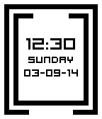

#Trace - A Pebble Watchface

A minimalist watch face for the Pebble smartwatch. 

The outer ring displays minutes and the inner ring indicates the hours. At five minute intervals, the tracing block animates 1/12th of the way along the edge. For example, the image below indicates a time of 7:15.

## Screenshots 

#### Inverted:

#### Flick View Styles:

## Installation

Requires Pebble 2.0 firmware and above to install this watch face. 

Simply search for [Trace](https://apps.getpebble.com/en_US/application/52ef5b1dc503c80b8d000028) in the Pebble App Store to load it onto your device!
Or alternatively, [click here](pebble://appstore/52ef5b1dc503c80b8d000028/) from your mobile device to launch the Pebble Appstore directly.

## Changelog
- 1.4
    - Updated URL pointing to configuration page.
- 1.3.1
	- Fixed bug where a letter from Wednesday would get cut from display. 
- 1.3.0
	- Added different flick view styles. Updated configuration page respectively.
- 1.2.0
    - Ability to show the date for a few seconds with the flick of the wrist.
- 1.1.0
    - Invert watch face via the new configuration screen.
    - Set a 5 minute vibrate interval via the configuration screen.

- 1.0.0
    - Initial release

## Credit
- Thanks to [@C-D-Lewis](https://github.com/C-D-Lewis) for his easy to follow tuts and examples to help get me started!
- Pebble Appstore badge provided by [@matthewtole](https://github.com/matthewtole) via [PblWeb](http://pblweb.com/)